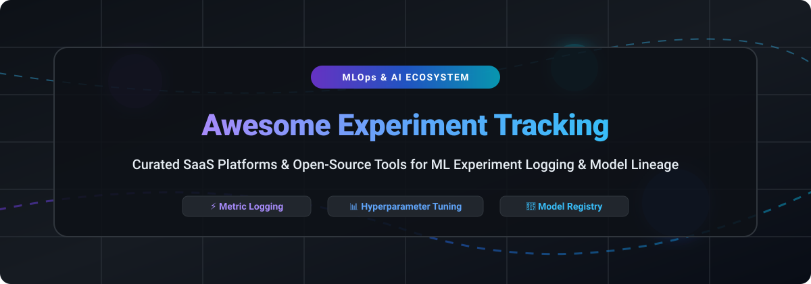

  
  
  
  
  
  

  

# 🚀 Awesome Experiment Tracking Platforms

> **A curated list of top SaaS products and open-source GitHub projects for Machine Learning Experiment Tracking, MLOps, Metric Logging, Run Comparison, Artifact Versioning & Model Lineage.**

---

## 📌 Overview & SEO Keywords

Welcome to the definitive ecosystem directory for **Experiment Tracking in Machine Learning (ML)** and **MLOps**. Modern ML engineers and data science teams require robust tooling to log hyperparameters, track loss curves, version datasets, manage model registries, and ensure full reproducibility across training runs.

* **Primary Focus Areas:** ML Experiment Logging, Model Lineage, Hyperparameter Optimization, Dataset Versioning, Model Governance, MLOps Pipelines.
* **Target Audience:** ML Engineers, Data Scientists, AI Researchers, MLOps Architects, & Technical Leads.

---

## 📑 Table of Contents

- [🏢 SaaS & Hosted Platforms](#-saas--hosted-platforms)
- [🔓 Open-Source GitHub Projects](#-open-source-github-projects)
- [🤝 How to Contribute](#-how-to-contribute)
- [💖 Support & Community](#-support--community)
- [📈 Star History](#-star-history)
- [⚠️ Disclaimer](#%EF%B8%8F-disclaimer)

---

## 🏢 SaaS & Hosted Platforms

📊 **Market Size & Industry Dynamics:**  
The global **MLOps and Experiment Tracking market** is estimated at **~$2.1 Billion** in 2026 and is projected to reach over **$10 Billion by 2030** (CAGR ~36%). The sector is **moderately fragmented**—led by high-growth category unicorns like Weights & Biases alongside hyperscaler tooling, yet supported by a diverse ecosystem of specialized commercial hosted platforms and open-source backends.

The table below is sorted by **Company Scale / Valuation (Descending)**:

| 🛠️ Platform | 💰 Company Scale / Valuation | 🏷️ Starting Paid Price | 🎁 Free Tier / Trial Limits | ⚡ Key Features & Core Focus |
| :--- | :--- | :--- | :--- | :--- |
| **[Weights & Biases](https://wandb.ai/)** | **$1.25 Billion** Valuation ($250M Raised) | **$50 / user / month** | **Free Tier:** 5 seats, 5 GB storage, 1 GB Weave ingestion/mo | Interactive dashboards, W&B Sweeps hyperparameter optimization, model registry, integration with PyTorch, Keras, HuggingFace. |
| **[Neptune.ai](https://neptune.ai/)** | **~$350 Million** Valuation (OpenAI Acquisition) | **$150 / month** (3 team seats included) | **Free Tier:** 1 user, 128 GB storage, 200 compute logging hours/mo | Scalable experiment tracker for foundation models, Neptune Scale v3 architecture, multi-project reports & experiment forking. |
| **[Comet ML](https://www.comet.com/)** | **~$200 Million** Valuation ($69.8M Raised) | **$19 / user / month** | **Free Tier:** 1 user, 500 compute logging hours/mo | Automatic experiment logging, dataset versioning, Opik LLM evaluation, VPC & on-prem enterprise deployments. |
| **[ClearML Hosted](https://clear.ml/)** | **~$80 Million** Valuation ($16M Raised) | **$15 / user / month** | **Free Tier:** 3 users, 100 GB artifact storage, 1M API calls/mo | End-to-end open-core MLOps platform, pipeline orchestration, hyperparameter search, cloud autoscaling on AWS/GCP/Azure. |
| **[DVC Studio](https://studio.iterative.ai/)** | **~$60 Million** Valuation ($20M Raised) | **$50 / user / month** | **Free Tier:** 5 collaborators, 3 projects | Git-native experiment tracking hub built on DVC, cloud run execution, VS Code extension integration. |
| **[DagsHub](https://dagshub.com/)** | **~$30 Million** Valuation ($3.6M Raised) | **$99 / user / month** | **Free Tier:** 20 GB storage, 100 tracked experiments in private repos | Collaborative ML platform leveraging MLflow and DVC, Git-based model versioning, data labeling integrations. |
| **[Polyaxon Cloud](https://polyaxon.com/)** | **~$15 Million** Valuation (Seed Funded) | **$555 / month** (3 seats, 1 cluster) | **Free Tier:** Community Edition (Self-Hosted, 100% Free) | Kubernetes-native control plane for ML training, run tracking, lineage, runtime state management. |
| **[Guild AI](https://guild.ai/)** | **~$5 Million** Scale (Open-Source Core) | **$0 / month** (100% Free Open-Source) | **Free Tier:** Full core toolkit free forever (Self-Hosted) | Zero-code-change experiment tracking, Bayesian hyperparameter tuning, local & remote execution. |

---

## 🔓 Open-Source GitHub Projects

Below is a curated collection of active open-source experiment tracking platforms and MLOps libraries. 

The list is sorted by **GitHub Stars_Count (Descending)**:

1. **[MLflow](https://github.com/mlflow/mlflow)**  
     
   The most widely adopted open-source ML lifecycle platform. Offers experiment logging (`mlflow.log_param`, `mlflow.log_metric`), model registry, and project packaging. **Apache-2.0**.

2. **[Optuna](https://github.com/optuna/optuna)**  
     
   Automatic hyperparameter optimization framework designed for machine learning with flexible search spaces and efficient sampling algorithms. **MIT**.

3. **[DVC (Data Version Control)](https://github.com/iterative/dvc)**  
     
   Git-based data versioning and experiment management system. Enables reproducible ML pipelines without duplicating huge datasets. **Apache-2.0**.

4. **[Aim](https://github.com/aimhubio/aim)**  
     
   Supercharged, open-source experiment tracker. High-performance UI built to compare thousands of training runs instantly with AimQL query language. **Apache-2.0**.

5. **[ClearML Open-Source Core](https://github.com/allegroai/clearml)**  
     
   Open-source suite for tracking, orchestration, and model management with zero code modifications needed. **Apache-2.0**.

6. **[ZenML](https://github.com/zenml-io/zenml)**  
     
   Extensible, open-source MLOps framework to create production-ready machine learning pipelines with built-in experiment tracking stack integrations. **Apache-2.0**.

7. **[Sacred](https://github.com/IDSIA/sacred)**  
     
   Tool to configure, organize, log, and reproduce machine learning experiments backed by MongoDB or SQL backends. **MIT**.

8. **[Kedro](https://github.com/kedro-org/kedro)**  
     
   Open-source Python framework for creating reproducible, maintainable, and modular data science and machine learning code. **Apache-2.0**.

9. **[Polyaxon Community Edition](https://github.com/polyaxon/polyaxon)**  
     
   Kubernetes-native open-source MLOps platform for managing training experiments, workflow orchestration, and model lineage. **Apache-2.0**.

10. **[LabML](https://github.com/labmlai/labml)**  
      
    Lightweight library for tracking Deep Learning experiments and monitoring hardware metrics on mobile and desktop dashboards. **MIT**.

11. **[Hopsworks](https://github.com/hopsworks/hopsworks)**  
      
    Open-source Feature Store and MLOps platform with built-in experiment tracking and model registry infrastructure. **Apache-2.0**.

12. **[Guild AI](https://github.com/guildai/guildai)**  
      
    Open-source experiment tracking and Bayesian optimization toolkit that records runs without modifying source code. **Apache-2.0**.

13. **[Rubicon ML](https://github.com/rubicon-ml/rubicon-ml)**  
      
    Python library that captures ML experiment metadata, parameters, and metrics in Git-friendly formats or S3. **Apache-2.0**.

---

## 🤝 How to Contribute

Contributions are welcome! Please follow these simple guidelines:

1. Fork this repository.
2. Add your tool under either [SaaS & Hosted Platforms](#-saas--hosted-platforms) or [Open-Source GitHub Projects](#-open-source-github-projects).
3. Ensure all links, pricing details, Stars_Badges, and descriptions are accurate and concise.
4. Submit a Pull Request (PR) with a clear title and summary.

---

## 💖 Support & Community

Thank you for exploring **Awesome Experiment Tracking Platforms**! If you find this repository helpful for your MLOps workflows, please consider supporting the project:

* 🌟 **Star** this repository to help others discover it.
* 🔀 **Fork** and contribute new tools or update existing entries.
* 📢 **Share** with your colleagues, ML teams, and data science community.
* ☕ **Sponsor / Buy me a coffee**: Support ongoing maintenance via the [GitHub Sponsors Dashboard](https://github.com/sponsors/ishandutta2007).

Check out our full collection of awesome curated lists at **[Awesome-Awesome-Awesome](https://github.com/ishandutta2007/Awesome-Awesome-Awesome)**!

---

## 📈 Star History

---

## ⚠️ Disclaimer

- This list is **community-curated** for informational purposes and does not imply official endorsement.
- SaaS plan limits and pricing are subject to vendor updates. Always check official product sites for the latest details.
- Self-hosted open-source software requires appropriate cloud or on-premise infrastructure for hosting backends and database storage.

---

  <b>Made with ❤️ for ML Engineers, Data Scientists, and MLOps Practitioners worldwide.</b>

